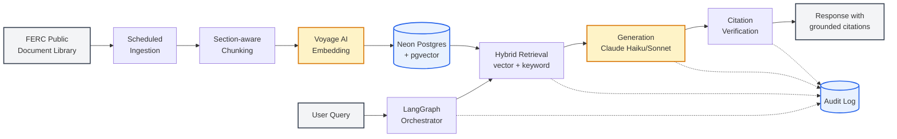
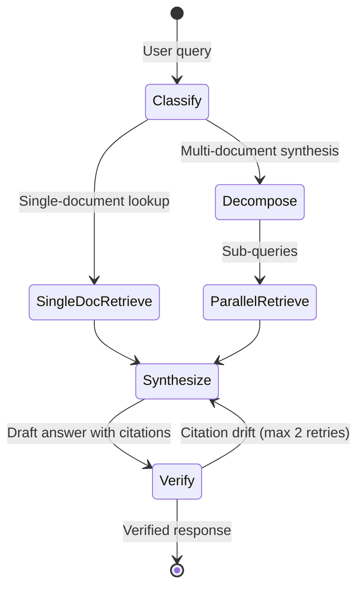

# RegRAG: An Agentic Retrieval System for Public-Sector Regulatory Corpora

*A capability demonstration in retrieval-augmented generation over FERC orders, with grounded citations, agentic query decomposition, and an audit trail designed for regulated environments.*

---

## 1. Problem Statement

FERC orders govern how electricity is generated, transmitted, and sold across the United States. They are also long, dense, and cumulative — Order 2222 modifies Order 841, which clarified prior rulings on storage participation, which themselves built on a decade of capacity market doctrine. A compliance analyst asking "what does Order 2222 require for DER aggregation, and how does it interact with Order 841?" is doing real work: reading multiple documents, holding their structure in memory, and synthesizing across them.

RAG systems are well-suited to this shape of problem. The challenge in a regulatory domain is not whether retrieval-augmented generation can answer the question — it is whether the system can be trusted to refuse when it shouldn't, cite faithfully when it does, and produce an audit trail that survives review.

This project is a working demonstration of that system. It ingests FERC orders, indexes them with hybrid vector and keyword search, and uses a LangGraph orchestration layer to decompose multi-document questions into independently retrievable sub-queries. Every answer carries citations to specific passages; every interaction is logged with the retrieved chunks, the prompt sent, and the model used. The case study below walks through the architecture, the engineering tradeoffs, and what would need to change for a production deployment in a federal context.

---

## 2. Users and Use Cases

The system is designed for the class of professionals who currently read FERC orders end-to-end as a routine part of their work. Four representative user types shaped the design:

**The compliance analyst at an investor-owned utility** asks operational questions tied to specific obligations — "what reporting requirements does Order 2222 create for our DER aggregation program, and what's the deadline?" These questions are usually single-document, but the answer needs to cite specific paragraphs because it will end up in a compliance memo.

**Counsel at an energy developer** asks interpretive questions across multiple orders — "how has FERC's treatment of capacity market participation evolved across recent rulings?" These questions require multi-document synthesis and benefit most from the agentic decomposition layer described in section 4.

**Federal agency staff** ask procedural and stakeholder-comment questions — "summarize the public comments on the Order 2222 NOPR and FERC's responses." These are corpus-bounded research questions where refusal-on-out-of-scope is essential; the system must not invent commenter positions.

**Policy researchers** ask comparative questions — "compare DER treatment across Orders 2222, 841, and 745." These are the canonical use case for the agentic layer and the hardest to handle correctly with a naive RAG implementation.

Each persona produced a small set of seed questions used to drive the eval set in section 6.

---

## 3. Solution Architecture

The architecture follows the AI/ML lifecycle stages and reuses patterns from a prior production RAG system the author has shipped (Sift, a news synthesis platform).

**Ingestion** pulls FERC orders from the public document library on a scheduled job, with a one-time bulk load of a curated set of recent orders to seed the corpus. **Transformation** chunks documents using a section-aware splitter that preserves order numbering, paragraph structure, and footnote references rather than the naive fixed-token chunking that would fragment regulatory citations. **Embeddings** are generated with Voyage AI's voyage-3-lite model and stored in Neon Postgres with the pgvector extension as a shared vector store.

**Retrieval** uses hybrid search — vector similarity over the embedding space combined with keyword matching against docket numbers, order numbers, and statutory citations. The hybrid step matters more for regulatory corpora than for general-purpose RAG; users routinely query by exact identifiers that pure semantic search handles inconsistently.

**Orchestration** is a LangGraph state machine that classifies incoming queries and routes them through either a direct retrieval path or a multi-step decomposition path. **Generation** uses Anthropic's Claude family — Haiku for single-document lookups where latency and cost dominate, Sonnet for multi-document synthesis where reasoning quality dominates. **Monitoring** captures every step into an append-only audit log described in section 5.

---

## 4. The Agentic Layer

The orchestration layer is what makes this system usable on the questions that motivated it. A user asking "compare DER treatment across Orders 2222, 841, and 745" cannot be served well by a single retrieval pass — the relevant passages are in three different documents, the comparison itself is a synthesis task, and the citations need to be attributable to the correct order.

The LangGraph workflow handles this in five stages:

First, an inexpensive classifier model determines whether the query is a single-document lookup or a multi-document synthesis. Single-document queries skip the decomposition step entirely and go straight to retrieval; this routing decision matters because the agentic path adds latency and cost that aren't justified for simple lookups.

Second, for synthesis queries, a decomposition step breaks the question into sub-queries — one per document, sub-topic, or comparison axis. Third, retrieval runs in parallel against each sub-query, gathering chunks scoped to the appropriate document set. Fourth, a synthesis step generates the final answer with explicit attribution structure: each claim is associated with the sub-query that produced its supporting chunks. Fifth, a verification pass confirms that every cited passage actually exists in the retrieved set before the answer is returned to the user — citations that cannot be verified are stripped or trigger a regeneration.

The agentic framing here is deliberate. The system is not just an LLM with retrieval bolted on; it is a multi-step inspectable workflow where each stage produces a typed artifact (classified intent, sub-query list, retrieved chunks, draft answer, verified citations) that can be logged, replayed, and audited. That property is what makes the system suitable for a public-sector context, not the LLM behind it.

---

## 5. Hallucination Control and Auditability

This is the section that matters most for a regulated deployment, and it is where most demo-grade RAG systems fall short.

**Grounding constraints** are enforced through the system prompt and the retrieval interface jointly. The generation step receives only the retrieved chunks and is instructed to refuse questions the corpus does not support. A query like "what is FERC's position on residential rooftop solar permitting" returns a refusal with an explanation that residential permitting is generally a state-level matter and the corpus does not contain authoritative federal guidance on it. The refusal is the deliverable; manufacturing an answer would be the failure.

**Citation verification** runs as a post-generation step. Every claim in the generated response is checked against the retrieved chunks (regex extraction of `[[chunk_id]]` markers, lookup against the retrieved set), and any citation that does not map to an actual passage is removed before the response is returned. The regeneration loop is bounded at two attempts; after that, invalid citations are stripped and the answer is finalized. On the current 28-question eval, the LLM-as-judge measures **citation faithfulness at 70.3%** — meaning ~30% of cited claims are attributed to chunks that don't substantively support them. Most failures are the same shape: the model cites a chunk that is *topically* about the right area but doesn't contain the specific assertion the answer makes (a chunk discussing commenter views vs. a chunk stating the Commission's rule, for instance). Catching these cases — both for verification at runtime and for measurement during eval — is the whole point.

**Audit logging** captures, for every interaction: a timestamp, the user identifier, the raw query, the classification decision, the decomposed sub-queries (if any), the retrieved chunks with their document and section provenance, the prompt sent to the generation model, the model identifier and version, the raw model response, the verified response returned to the user, and the latency and token counts for each stage. The schema is append-only and partitioned by date.

**Failure modes** are handled explicitly rather than implicitly. When retrieval returns nothing relevant, the system says so. When the corpus is silent on the question, the system says so. When the question is ambiguous, the system asks a clarifying question rather than picking an interpretation. Each of these behaviors is testable and is exercised in the eval set.

The argument here is not that this system cannot fail. It is that when it fails, the failure is inspectable, attributable to a specific stage of the pipeline, and recoverable through targeted intervention rather than wholesale retraining.

---

## 6. Evaluation

The eval set is 28 hand-crafted question/answer pairs — 5 in-scope plus 2 out-of-scope per persona, balanced across the four user personas in section 2. Each pair specifies the question, the expected source documents, the expected supporting passage keywords, and the expected behavior (answer or refuse).

Three metrics are tracked per eval run:

**Retrieval recall** — what fraction of the expected supporting passage keywords appear in the retrieved chunk set? This isolates retrieval quality from generation quality.

**Citation faithfulness** — what fraction of cited claims in the generated response are substantively supported by the chunks they cite? Graded with a separate LLM-as-judge step (Sonnet) that scores each claim/chunk pair 0/1. Known LLM-as-judge limitations apply (judge bias toward verbose answers, sensitivity to prompt wording, and lower agreement with human raters on subtle calls); the judge prompt is versioned alongside the eval set and a periodic spot-check against human review is the calibration mechanism.

**Refusal accuracy** — for both the out-of-scope subset (should refuse) and the in-scope subset (should answer), did the system do the right thing?

The eval harness runs on every change to retrieval, chunking, or generation parameters; results are logged with the same audit infrastructure used for live queries, which means the eval history is itself a tracked artifact rather than a one-off notebook.

**Current results** (28 questions, voyage-3.5-lite + claude-sonnet-4-6 + claude-haiku-4-5):

| Metric | Score | Notes |
|---|---|---|
| Retrieval recall | **98.3%** | Macro-averaged over 20 answer-expected questions |
| Refusal accuracy | **89.3%** | 25/28 — 3 borderline OOS researcher questions got qualified answers instead of refusal |
| Citation faithfulness | **70.3%** | LLM-as-judge over all cited claims; lowest on questions that conflate commenter views with Commission rulings |

Per-persona breakdown shows the expected pattern: comparative researcher questions are hardest (refusal 71%, faithfulness 65%) and single-doc compliance questions are easiest (refusal 100%, faithfulness 72%). The full per-question report including judge rationale lives in `packages/eval/results/`.

---

## 7. Engineering Tradeoffs

Four decisions shaped the system most and are the ones worth defending in detail.

**Model selection per query type.** Routing single-document queries to Haiku for classification and Sonnet for synthesis is a unit-economics decision as much as a quality decision. On the current eval set, the classifier routes 46% of queries down the single-doc path (one retrieval, one synthesis call) and 54% down the multi-doc path (decomposition + parallel retrieval + synthesis), with a 22-second median latency on the multi-doc path versus 10 seconds on the single-doc path. Haiku handles the classification step at near-trivial cost; Sonnet earns its place on the synthesis questions where chain-of-reasoning matters. The classifier itself runs at 85% accuracy against the eval set's labeled intents, with most misclassifications routing borderline OOS questions to the agentic path (a wasted decompose call but no correctness loss).

**Chunk size and section preservation.** Larger chunks preserve regulatory context (a paragraph that references an earlier section needs that section nearby) but reduce retrieval precision (more text per chunk dilutes the embedding signal). The compromise is a section-aware splitter that produces variable-size chunks bounded by a target ~800 tokens max, ~200 tokens min. Section boundaries come from FERC's own paragraph numbering (`170. Some commenters...`) where present, with a fallback to hierarchical section headings (`6. Single Resource Aggregation` → `a. NOPR Proposal`) for orders that use that structure (Order 2222 in particular). Naive fixed-token chunking would fragment regulatory citations that span multiple paragraphs and is the failure mode this design avoids.

**Hybrid versus pure-vector retrieval.** Pure vector search misses queries that hinge on exact identifiers — "Order 2222," docket number RM18-9, statutory references. The hybrid approach combines top-20 vector similarity with top-10 keyword matches over a 'simple'-tokenizer GIN index (preserves modal verbs and identifiers that English stemming would strip), fused via reciprocal rank fusion (k=60). An additional identifier-match recall floor guarantees that any chunk containing an exact identifier from the query is included in results regardless of vector or keyword score. On the eval set, retrieval recall reaches 98.3% — the corpus reliably surfaces the chunks that contain the answer, even when the surface form of the query doesn't match the chunk text closely.

**When to invoke the agentic decomposition.** The decomposition step adds ~2x latency (median 22s for multi-doc vs. 10s for single-doc) and an extra Sonnet call. Invoking it on every query would degrade the experience on single-document lookups. The classification step exists specifically to gate this decision; misclassification toward the agentic path wastes ~12 seconds and one Sonnet call, while misclassification away from it produces worse answers on synthesis questions because single-pass retrieval can't guarantee per-document coverage on comparative queries.

---

## 8. What This Would Need for a Real Engagement

A production deployment in a federal context would require additions in several directions, each of which is mentioned here to scope the gap between a capability demonstration and a delivered solution.

Authentication and access control would move from the demo's lightweight scheme to enterprise SSO with role-based access to corpus partitions; some agencies operate with corpora segmented by clearance level. Hosting would need to satisfy FedRAMP requirements at the appropriate impact level, which constrains both the cloud provider choice and the LLM provider choice. The corpus would need to be tuned to agency-specific terminology and ontologies — FERC's vocabulary is a starting point, but a deployment for a specific utility regulator or DOE office would require additional fine-tuning or prompt-level customization.

Human-in-the-loop review would be required for any output that could enter a compliance record or regulatory filing; the system would surface its draft answers into a review queue rather than returning them directly. Continuous corpus updates would need to handle versioning so that historical queries can be replayed against the corpus as it existed at the time. Integration with existing case management, document management, or compliance workflow systems would be the work that determines whether the tool is actually adopted.

None of these are research problems. They are the work that turns a demonstration into a delivered solution, and naming them is part of the deliverable.

---

## 9. Outcomes and Artifacts

*Build in progress. Live demo, source code, and current evaluation results will be linked here when the system ships. The architecture and LangGraph workflow diagrams are inline in sections 3 and 4 above.*

---

*Designed by Kristen Martino; build in progress. The architecture and patterns in this project draw on a prior production RAG system (Sift, [siftnews.kristenmartino.ai](https://siftnews.kristenmartino.ai)), an energy-domain ML platform (GridPulse, [gridpulse.kristenmartino.ai](https://gridpulse.kristenmartino.ai)), and 10+ years of analytics and program delivery in regulated environments.*
