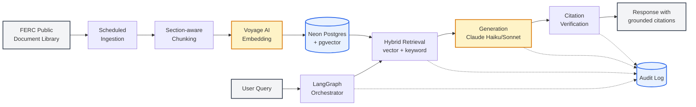
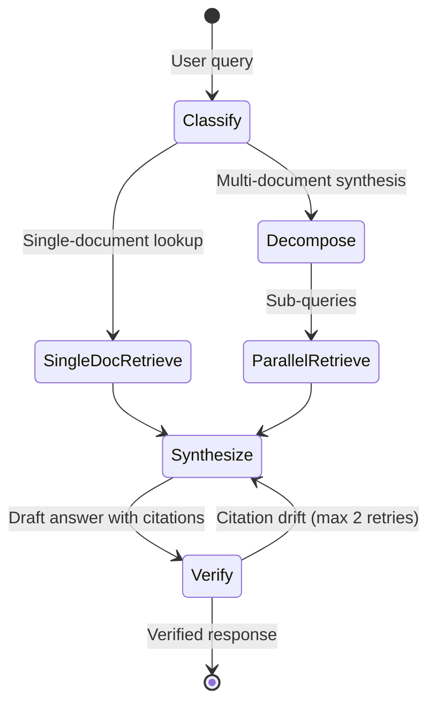

# RegRAG Diagrams

Two diagrams for the case study, in Mermaid format. Both render natively on GitHub, in most static-site generators, and at [mermaid.live](https://mermaid.live) for PNG/SVG export.

---

## 1. Architecture Diagram

Goes in **Section 3: Solution Architecture** of the case study. Shows the corpus pipeline (top) feeding the shared vector store, and the query pipeline (bottom) reading from it. Dotted lines indicate audit log writes from the orchestration, generation, and verification stages.

**Reading guide for the writeup:** the corpus pipeline (A → E) is asynchronous and runs on a schedule. The query pipeline (F → K) is synchronous and per-request. The shared vector store decouples them, which is what allows corpus updates to happen independently of query traffic. The audit log captures every step of the query pipeline that involves an LLM or routing decision; the corpus pipeline writes its own ingestion logs on a separate path not shown here.

---

## 2. LangGraph State Diagram

Goes in **Section 4: The Agentic Layer** of the case study. Shows the five-stage orchestration with the routing branch between single-document lookups and multi-document synthesis, and the verification loop that catches citation drift.

**Reading guide for the writeup:** classification is the gating decision — single-document queries skip decomposition entirely, which is what keeps latency reasonable for the 60% of queries that don't need agentic behavior. The verification loop is bounded (in the implementation, capped at two regeneration attempts before falling back to a refusal) but isn't shown in the diagram to keep it readable.

---

## Export and embedding notes

For the portfolio site, three options ranked by effort:

1. **Embed the Mermaid code directly** if your site supports it (Next.js + `rehype-mermaid`, MDX, GitHub Pages with Jekyll plugin, Astro with the Mermaid integration). Lowest maintenance — diagrams stay editable as code.
2. **Render to SVG once at [mermaid.live](https://mermaid.live)**, save the SVG, embed as ``. Higher fidelity, but you lose the inline editability.
3. **Render to PNG via Mermaid CLI** (`mmdc -i diagram.mmd -o diagram.png -t neutral`) for sites that don't support inline SVG cleanly.

The styling classes in the architecture diagram (`store`, `llm`, `io`) use a muted palette that should read well on most portfolio backgrounds; if you have brand colors, swap the hex codes in the `classDef` lines.
